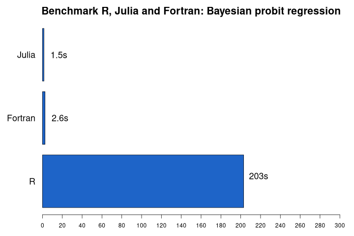
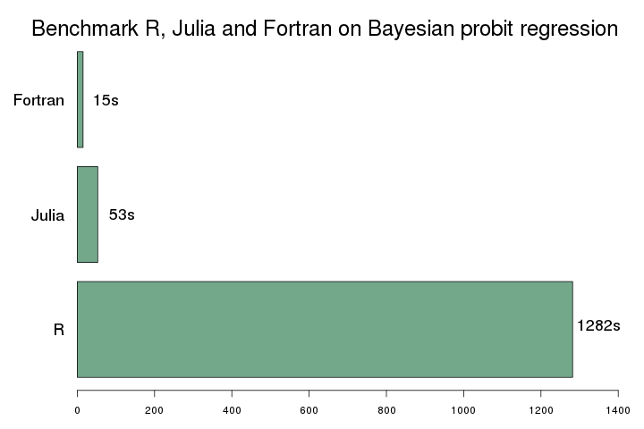

# Performance comparison R, Julia, Fortran for Bayesian binary probit
## tl;dr 
'Benchmarking' R, Julia and Fortran code that implements the Bayesian binary probit model using the Gibbs sampler from:

Albert and Chib (1993). Bayesian Analysis of Binary and Polychotomous Response Data. *Journal of the American Statistical Association*, 88(422), 669-679.

This is a replication of the performance comparison I did in 2015 (see old [blogpost](https://taptoenix.wordpress.com/2015/10/31/speed-comparison-between-r-julia-and-fortran-on-bayesian-probit-regression/)).
The folder v2015 contains the 2015 version of the code and v2021 contains the updated codes.
The results show a strong performance improvement for Julia versus Fortran/R.
The difference between Fortran and R has remained fairly the same.



## Intro
Almost 6 years ago, I did a small performance comparison of R, Julia and Fortran on the Bayesian binary probit model.
You can find a blogpost on that endavour [here](https://taptoenix.wordpress.com/2015/10/31/speed-comparison-between-r-julia-and-fortran-on-bayesian-probit-regression/).
Even though I was very positive about the capabilities of Julia at that time, I never really started to use Julia for my computational work.
Julia was on version 0.4.0 and much more stable than the earlier version I had tried, but still the syntax kept changing quite a bit and that made me hesitant to start a project in the language.
Also, I had been using R as my main stats/data language since 2006 and I kept going back to the tool I knew that got the job done.

But since Julia passed the 1.0.0 landmark, I felt that I should give it another try again.
Yes, that was 2018... time flies.
Anyway, lately I had a smaller project to tackle and decided I would give Julia a new try.
Collecting the data involved web scraping and I used the packages `HTML`,`Gumbo` and `Cascadia` for that.
Worked like a charm.
As an R user, transitioning to Julia felt more natural than Python (0 based indexing, indentation rules, dot notation, etc.).
And more importantly, the documentation and online help has improved a lot.

The web scraping project brought my old performance comparison to mind and I decided to find out how the same comparison would fare today.
And this is where this post is about.

## The algorithm 
The model is:

</br>
with:</br>
</br>
</br>
and</br>


The typical Bayesian approach for this model is to treat the latent variable  y\* as any other unknown parameter.
Then, conditional on (the simulated) y\*, the problem reduces to the well-known linear regression model.
An efficient Gibbs sampler for this model was first described in Albert & Chib (1993).

This model is well suited for comparing the performance of R, Julia and Fortran, because of the loops within loops that are required by the Gibbs sampler.
That is, in each MCMC iteration, a latent y\* has to be simulated from the truncated normal distribution for each observation.
It is well-known that this type of algorithm is very slow in interpreted languages as R (or Python).

For this benchmark, 5000 observations were simulated from the probit model, each containing two covariates plus an intercept.
The dependent variable is binary.
This data was stored as a csv file that was read by the different software implementations.
The MCMC algorithm in each implementation was run for 5000 iterations (leading to 25 million calls of Geweke’s accept-reject algorithm (1991) for the truncated normal draws).
The calculated execution times only relate to the wall time of the execution of the MCMC algorithm (not reading in data, etc.).

## Some technical details 
The runtimes presented below is the average over 5 executions of the code on the same data.
I ran the code on my Lenovo T480s laptop (CPU: i5-8250, MEM: 16 Gb DDR4, OS: ArchLinux).
R version 4.0.4, Julia version 1.5.4 and the Fortran compiler I used was gfortran (GCC 10.2.0) with the -03 optimization flag.
The Fortran code was compiled against the LAPACK/BLAS library (version 3.9.0).

Note that for the Julia code, it was necessary to get the dot product out of the loop (in the Fortran code, this did not led to a performance gain):
```julia
# Draw new value for ystar

## Option 1: Fortran equivalent (slower):
for ii = 1:n
  ystar[ii] = rtnorm(dot(X[ii,:],beta),1.0,y[ii])
end

## Option 2: Use matmul outside loop (vs. dot product inside loop) 
Xbeta = X*beta
for ii = 1:n
  ystar[ii] = rtnorm(Xbeta[ii],1.0,y[ii])
end

# Option 3: Using map to replace inner loop 
ystar = map((x,y)->rtnorm(x,1.0,y), X*beta, y)
```

Option 2 and 3 led to the same runtimes (about 1.5s). 
Option 1 led to runtimes slightly slower than Fortran (about 0.5s slower, so runtimes of about 3.1s).

Also, using BLAS specialized `dsymv` routine for multiplying symmetric matrices with vectors, did not improve the Fortran performance (over the `matmul` intrinsic).

## Results 
The figure below gives an overview of the average runtimes.


Note that these results should be taken with a grain of salt.
I've tried to make the different implementations as similar/fair as possible, but expert R, Fortran or Julia programmers might come up with improved implementations.
Also, this speed comparison might not follow all rules for a formal benchmark.

It's also important to realize that R, Julia (and Python) offer interfaces to performant libraries (often written in C/Fortran) specialized in Bayesian computations.
For example JAGS, STAN or PyMC3 (Python only).
Using one of these libraries probably give most Bayesians the best *bang for the buck* (ease of implementation vs speed).

First remarkable finding is that Julia outperforms Fortran on this task.
I was quite amazed by this as I believed that the Julia implementation could not be more performant than the Fortran code.
This seems not to be the case here (even though I'm not sure what the reason is).

Second, the Fortran code is about 78x faster than the R code.
That is fairly similar to the results of 2015 where I've found a 85x improvement.
The relative performance gain of Julia is amazing.
Partly because my new implementation is improved compared to 2015, but I'm sure another important reason is the improvements in the Julia language and JIT compiler.
Compare with the results of 2015 (that was run on very old hardware):



## Conclusion 
Julia is a really great language for scientific computing.
The combination of interactive programming via the REPL and the speed of a compiled language is a unique selling point.
Just like in 2015, I'm convinced that I will use the language much more often for my work.
The stable syntax and more widely available online help make me believe that this time it's not just good intentions. 
